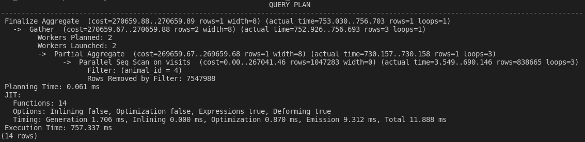
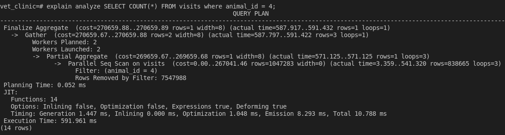
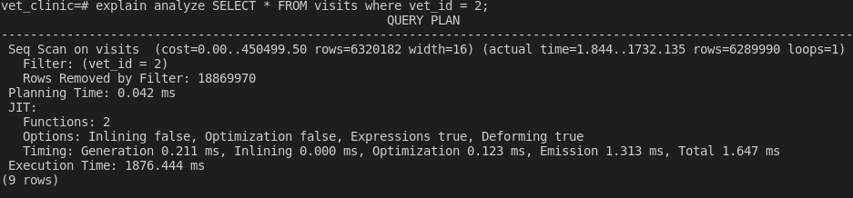
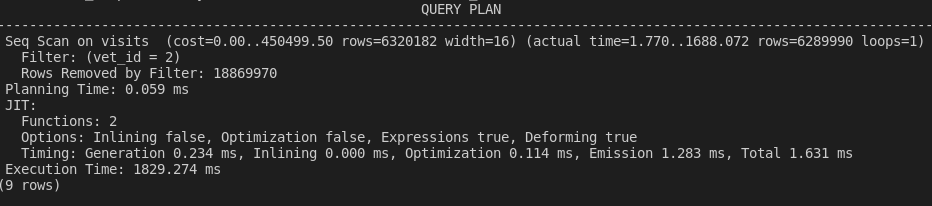
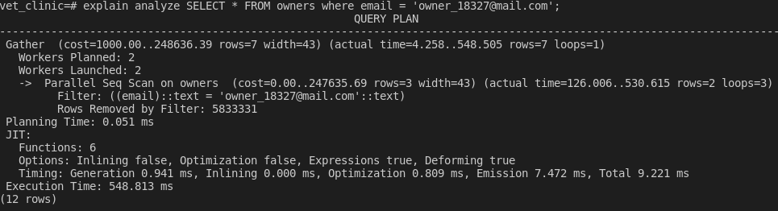
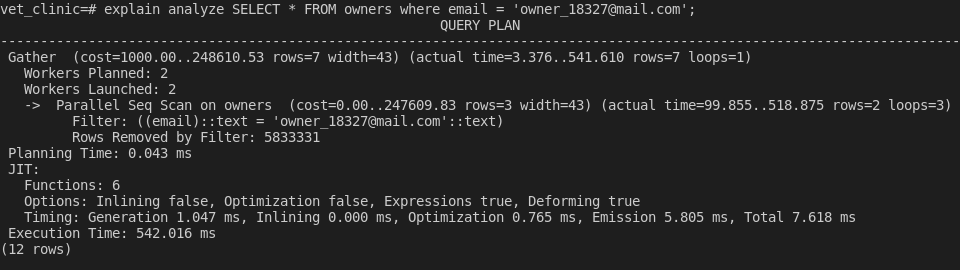

# database-performance-audit

> Assignment to test the performance of a database. 

EXPLAIN ANALYZE SELECT COUNT(*) FROM visits where animal_id = 4;

EXPLAIN ANALYZE SELECT * FROM visits where vet_id = 2;

EXPLAIN ANALYZE SELECT * FROM owners where email = 'owner_18327@mail.com';

## Getting Started

## Built With

- SQL
- Postgres 12
- VSCode
- Ubuntu 20.04.3

## Setup

- Get the link of the repository: `https://github.com/mugberto/database-performance-audit.git`
- Clone it as `https://github.com/mugberto/database-performance-audit.git` on a Terminal
- Change directory to it by `cd database-performance-audit`
- Change branch/create local branch to/of `feature-animal` and do a `git pull origin feature-animal`

## Authors

👤 **Author1**

👤**Makungong Collins Tatang**

- GitHub: [@CollinsTatang1](https://github.com/CollinsTatang)
- Twitter: [@CollinsTatang1](https://twitter.com/CollinsTatang1)
- LinkedIn: [Makungong Collins](https://www.linkedin.com/in/makungong-collins/)

👤 **Author2**

👤 **Hubert Mugabo**

- GitHub: [@githubhandle](https://github.com/mugberto)
- Twitter: [@twitterhandle](https://twitter.com/mugberto)
- LinkedIn: [LinkedIn](https://www.linkedin.com/in/hubert-mugabo-23144b6a/)

## 🤝 Contributing

Contributions, issues, and feature requests are welcome!

Feel free to check the [issues page](../../issues/).

## Show your support

Give a ⭐️ if you like this project!

## Acknowledgments

- Microverse
- [Microverse design team](https://app.zeplin.io/project/5b35a9e13227086040f8eb75/screen/5b695e29bb8c844f118f9378)

## 📝 License

This project is [MIT](./LICENSE) licensed.
